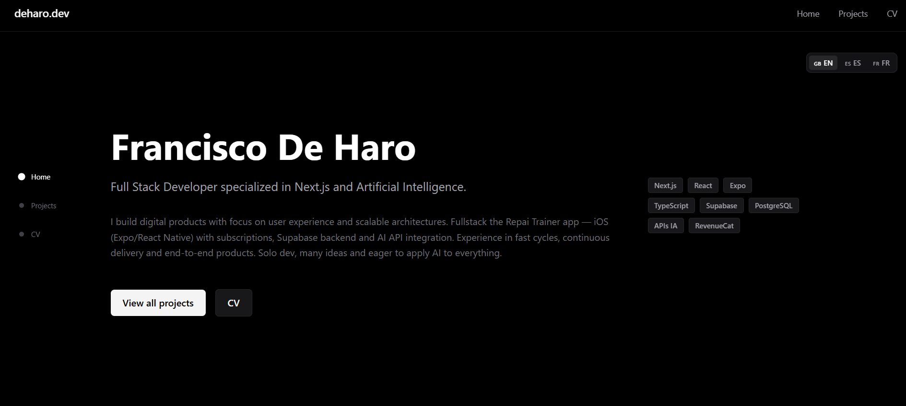

# deharo.dev — Portfolio of Francisco De Haro

**Live:** [https://deharo.dev](https://deharo.dev)
Full-Stack developer focused on **Next.js** and **AI**. Minimal, fast, and accessible dark-mode UI.

---

## Highlights

* Next.js 14 (App Router) + TypeScript + Tailwind (zinc/black palette)
* Fully responsive, keyboard-friendly, good contrast
* Dedicated **CV page** with downloadable PDF
* Project cards with detail pages, screenshots, and links
* Production build hosted on Vercel

## Table of Contents

* Preview
* Tech Stack
* Project Structure
* Key Projects
* Run Locally (optional)
* Customization
* Contact

## Preview

## Tech Stack

* **Framework:** Next.js 14 (App Router)
* **Language:** TypeScript
* **Styles:** Tailwind CSS
* **Hosting:** Vercel

## Project Structure

deharo.dev/
• app/
 • data/ → projects.ts (project data)
 • projects/ → page.tsx (projects listing)
 • cv/ → page.tsx (CV page)
 • globals.css (Tailwind globals)
 • layout.tsx (root layout)
 • page.tsx (landing page)
• components/
 • ProjectCard.tsx (project card component)
• public/
 • cv.pdf (CV in PDF)
 • favicon.ico
• next.config.js
• tailwind.config.ts
• tsconfig.json
• package.json

## Key Projects

* **Repai Trainer** — iOS training app (Expo/React Native + Supabase)
* **AI Chat Demo** — Interface connected to Mistral AI
* **Portfolio** — This website (Next.js 14 + Tailwind + Vercel)

> For reviewers: the live site reflects performance and accessibility choices; the repo shows code structure and component reuse.

## Run Locally (optional)

Requirements: Node.js 18+

1. Install dependencies: `npm install` (or `yarn install` / `pnpm install`)
2. Start dev server: `npm run dev` and open [http://localhost:3000](http://localhost:3000)
3. Production build: `npm run build` → `npm run start`

## Customization

* **Personal info:** edit `app/page.tsx` (hero) and `app/layout.tsx` (footer)
* **CV content:** edit `app/cv/page.tsx` and replace `public/cv.pdf`
* **Projects:** update `app/data/projects.ts` 
* **Colors:** adjust the palette in `tailwind.config.ts`

## Contact

* Email: [frandeharo55@gmail.com](mailto:frandeharo55@gmail.com)
* GitHub: [https://github.com/deHaro5](https://github.com/deHaro5)
* Portfolio: [https://deharo.dev](https://deharo.dev)

---

© 2025 Francisco De Haro
